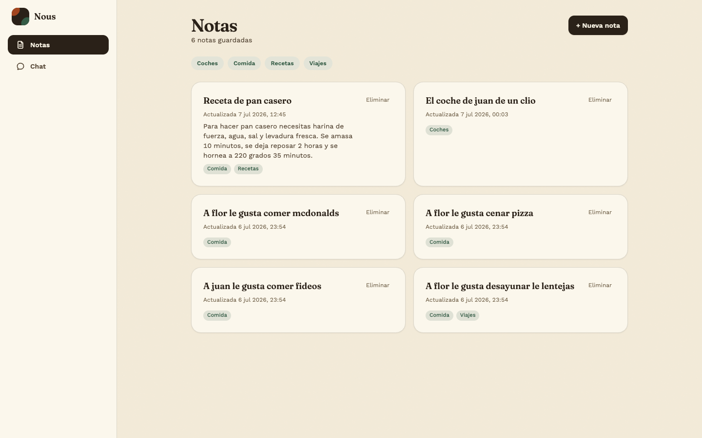
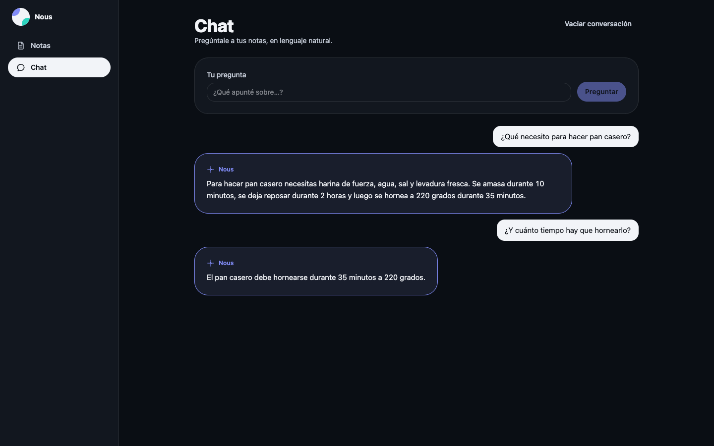
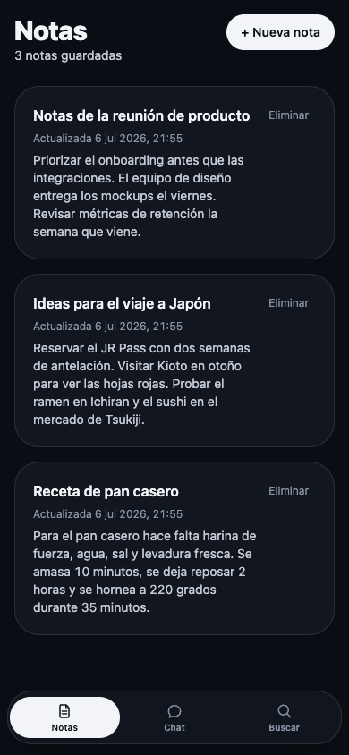

# Nous

[](https://github.com/jadueno/nous/actions/workflows/ci.yml)

Tu segundo cerebro personal autoalojado: escribe notas y mantén una conversación en lenguaje natural sobre ellas — respuestas generadas de verdad (RAG con IA local, no un buscador con plantillas encima), ancladas siempre a lo que hay realmente en tus notas, con memoria de lo ya preguntado.

📐 Arquitectura, decisiones técnicas y aprendizajes en **[ARCHITECTURE.md](ARCHITECTURE.md)**.

## Capturas

Datos ficticios de ejemplo.

| Notas (escritorio) | Chat (escritorio) | Notas (móvil) |
| --- | --- | --- |
|  |  |  |

## Por qué

Las alternativas cloud (Notion AI, Mem, Tana) no te dejan ser dueño de tus datos; las autoalojadas open-source (Khoj, Onyx, Quivr) están pensadas para equipos, con arquitecturas pesadas para un uso genuinamente personal. Nous es ligero (Postgres + `pgvector`, sin servicio de BD vectorial aparte), autoalojado, y con el proveedor de IA (embeddings + LLM) intercambiable por diseño — por defecto corre en local con **Ollama** (gratis, tus notas nunca salen del Mac), con Claude + Voyage AI como alternativa opcional de pago si algún día quieres mejor calidad.

## Configuración inicial

Necesitas Node.js, npm y Docker instalados.

```bash
# 1. Variables de entorno
cp .env.example .env
cp backend/.env.example backend/.env
# Edita ambos .env y pon tu propia contraseña de Postgres (debe
# coincidir en los dos archivos, tanto en POSTGRES_PASSWORD como
# dentro de DATABASE_URL).

# 2. IA local con Ollama (recomendado, gratis y privado)
brew install ollama
brew services start ollama
ollama pull mxbai-embed-large
ollama pull qwen2.5:7b-instruct
# Descomenta OLLAMA_BASE_URL en backend/.env
# (alternativa: ANTHROPIC_API_KEY/VOYAGE_API_KEY, de pago, mejor calidad)

# 3. Base de datos
docker compose up -d
cd backend && npm install && npm run migrate:up && cd ..

# 4. Backend y frontend
cd backend && npm run dev   # otra terminal
npm install && npm run dev  # raíz del proyecto
```

Sin ningún proveedor configurado (ni Ollama ni claves), la app arranca igual con respuestas simuladas — útil para probar la interfaz sin instalar nada.

## Tests

```bash
npm test              # frontend
cd backend && npm test # backend (necesita TEST_DATABASE_URL, nunca la BD real)
npm run test:e2e       # E2E con Playwright
```
